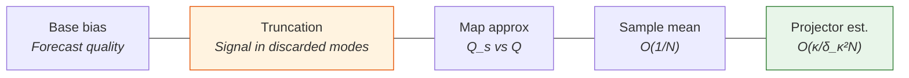
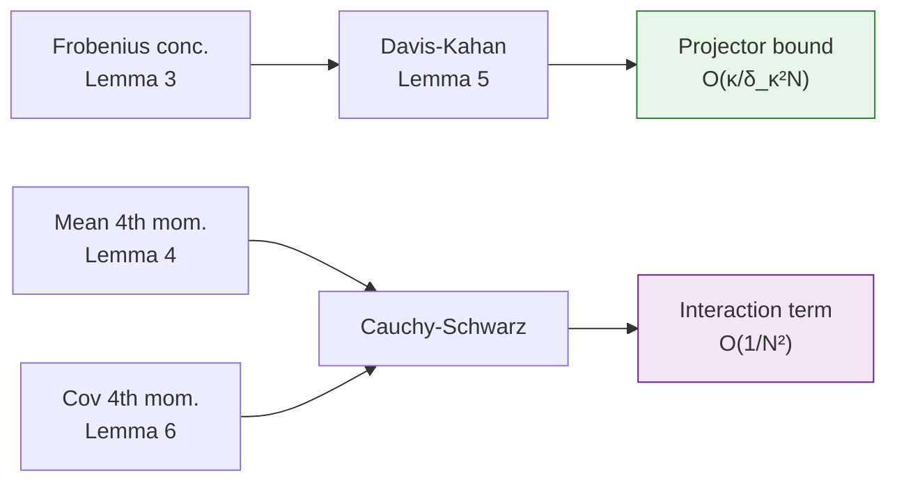
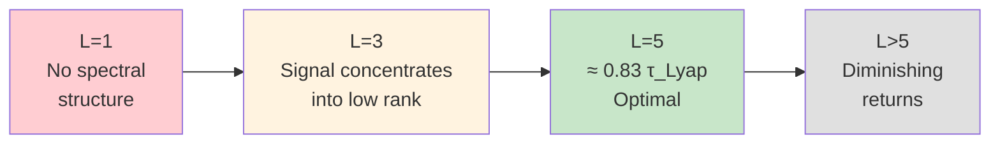

# Backup Slides

---

## B1: Full Bias Bound (Theorem 4)

$$\text{Bias}^2(\kappa,s) \;\leq\; 2\,\text{Bias}_{\text{base}}^2(s) \;+\; 4\,\mathbb{E}[\|\mathbf{K}^{\text{DC}}\|_2^2]\,\|\mathbf{R}^{(L)}\|_2\,\|(\mathbf{I}-\mathbf{P}_\kappa^s)\boldsymbol{\mu}_E^s\|^2$$
$$+\; 2\,C_m\,\|Q_s - Q\|_{L^2}^2 \;+\; \frac{2\|\mathbf{R}^{(L)}\|_2}{N}\,\mathbb{E}[\|\mathbf{K}^{\text{DC}}\|_2^2]\,\text{tr}(\boldsymbol{\Sigma}_E^s) \;+\; 2\,C_p\,\frac{\kappa}{\delta_\kappa^2}\,\mathbb{E}[\|\mathbf{C}_E^s - \boldsymbol{\Sigma}_E^s\|_F^2]$$

> **Truncation term** vanishes when $\boldsymbol{\mu}_E$ aligns with leading $\kappa$ modes. **Projector term** shrinks with larger spectral gap.

<!--
Speaker Notes:
The full bias bound has five terms. The base bias is the irreducible error from imperfect forecasting. The truncation term depends critically on alignment: it measures the projection of the mean innovation onto the discarded subspace, which is geometrically distinct from the eigenvalue tail sum. If the systematic mismatch lies within the leading eigenspace, this term vanishes. The map approximation term is orthogonal to the sampling and truncation mechanisms. The last two terms are O(1/N): sample mean fluctuation and projector estimation error. The projector term has the crucial kappa/delta-kappa-squared prefactor. In our experiments, kappa=1 with a large gap, making this contribution very small.
-->

---

## B2: Full Variance Bound (Theorem 5)

$$\text{Var}(N,\kappa,s) \;\leq\; \frac{2}{N}\,\mathbb{E}[\|\mathbf{x}^{(1),f} - \boldsymbol{\mu}^f\|^2] \;+\; \frac{2\|\mathbf{R}^{(L)}\|_2}{N}\,\mathbb{E}[\|\mathbf{K}^{\text{DC}}\|_2^2]\,\text{tr}(\boldsymbol{\Sigma}_E^s)$$
$$+\; 2\|\mathbf{R}^{(L)}\|_2\,\mathbb{E}\!\left[\|\mathbf{K}^{\text{DC}}\|_2^2\,\|(\hat{\mathbf{P}}_\kappa^s - \mathbf{P}_\kappa^s)(\bar{\mathbf{e}}^s - \boldsymbol{\mu}_E^s)\|^2\right]$$

**Gaussian corollary** (Corollary 1): The projector-mean interaction term satisfies

$$\mathbb{E}\!\left[\|(\hat{\mathbf{P}}_\kappa - \mathbf{P}_\kappa)(\bar{\mathbf{e}} - \boldsymbol{\mu}_E)\|^2\right] \;\leq\; C \cdot \frac{\kappa}{\delta_\kappa^2} \cdot \frac{\text{tr}(\boldsymbol{\Sigma}_E^2)}{N(N-1)} \cdot (\text{4th moment})^{1/2}$$

> **Key**: Projector and sample mean are dependent (same ensemble), requiring Cauchy-Schwarz. Net contribution is $O(1/N^2)$.

<!--
Speaker Notes:
The variance bound has three terms. The first two are standard O(1/N) Monte Carlo contributions—forecast sampling and residual sampling. The third term is the most subtle: the interaction between projector estimation error and sample mean fluctuation. These are statistically dependent since both are computed from the same ensemble, precluding a simple independence argument. We use Cauchy-Schwarz to decouple the fourth moments, then invoke the concentration lemma for covariance error and the fourth-moment bound for the sample mean. Under Gaussianity, each factor contributes O(1/N), making the product O(1/N²)—faster than the leading terms. This is why the net variance is dominated by the O(1/N) terms with a kappa-dependent, not d-dependent, prefactor.
-->

---

## B3: Concentration Lemmas

| Result | Statement | Assumptions |
|---|---|---|
| **Lemma 2** (Unbiasedness) | $\mathbb{E}[\mathbf{C}_E] = \boldsymbol{\Sigma}_E$ | i.i.d., finite 2nd moment |
| **Lemma 3** (Frobenius) | $\mathbb{E}[\|\mathbf{C}_E - \boldsymbol{\Sigma}_E\|_F^2] \leq \frac{C_{\text{cov}}}{N-1}\,\text{tr}(\boldsymbol{\Sigma}_E^2)$ | i.i.d., finite 4th moment |
| **Lemma 4** (Mean 4th moment) | $\mathbb{E}\|\bar{\mathbf{e}} - \boldsymbol{\mu}_E\|^4 = O(N^{-2})$ | i.i.d., finite 4th moment |
| **Lemma 6** (Wishart 4th moment) | $\mathbb{E}[\|\mathbf{C}_E - \boldsymbol{\Sigma}_E\|_F^4] \leq \frac{C_W}{(N-1)^2}\,(\text{tr}(\boldsymbol{\Sigma}_E^2))^2$ | Gaussian |

<!--
Speaker Notes:
The concentration results build systematically. Lemma 2 establishes unbiasedness of the Bessel-corrected sample covariance—a standard result. Lemma 3 bounds the mean-square Frobenius deviation at O(1/N), requiring only finite fourth moments. This is the workhorse estimate that feeds into Davis-Kahan. Lemma 4 gives a fourth-moment bound for the sample mean, needed for the Cauchy-Schwarz decoupling in the variance bound. Lemma 6 provides fourth-moment control for the covariance error under Gaussianity, using the Wishart structure of the centered sample covariance. These feed through two pathways: Frobenius concentration through Davis-Kahan to projector accuracy, and fourth-moment bounds through Cauchy-Schwarz to control the dependent interaction term.
-->

---

## B4: Robustness to Non-Ideal Errors

- **Non-Gaussian obs errors**: Student-t ($\nu$=5), uniform, mixture
- QPCA-EnDCF: $\bar\gamma \approx$ 0.75-0.85 across all distributions
- **Correlated obs errors**: exponential decay in space
- Whitening absorbs correlation: $\mathbf{E} = \mathbf{R}^{-1/2}(\mathbf{Z} - \mathbf{z}\mathbf{1}^\top)$

> Theory requires finite 4th moments, not Gaussianity. Robustness is built into the framework.

<!--
Speaker Notes:
A natural concern is whether results depend on Gaussian observation errors. We tested Student-t errors with 5 degrees of freedom, uniform errors, and Gaussian mixtures. QPCA-EnDCF maintains spread-skill ratios between 0.75 and 0.85 across all distributions because the spectral regularization operates on ensemble covariance structure, not individual residual distributions. We also tested spatially correlated observation errors with exponential decay. The whitening transformation absorbs the correlation through R-inverse-half, preserving the isotropic geometry in whitened coordinates. The theoretical assumptions require only finite fourth moments—strictly weaker than Gaussianity. This robustness is not a coincidence but a design feature of the spectral approach.
-->

---

## B5: Inflation Analysis

| | Inflation needed? | Mechanism |
|---|---|---|
| Stochastic EnKF | $\lambda_{\text{infl}} \geq 1.05$ | Counteract perturbation noise + rank deficiency |
| **QPCA-EnDCF** | **None** ($\lambda_{\text{infl}} = 1.00$) | Spectral truncation preserves orthogonal diversity |

- Corrections confined to rank-$\kappa$ subspace
- Remaining $N - 1 - \kappa$ ensemble DOF: **exactly preserved**
- $\kappa$ sensitivity: performance flat across $\kappa \in \{1, 2, 3\}$

<!--
Speaker Notes:
One of the most practically significant findings: QPCA-EnDCF requires no inflation. In stochastic methods, inflation is essential—without it, sampling noise and perturbation-induced variance compression cause rapid ensemble collapse and filter divergence. QPCA-EnDCF avoids this because corrections are confined to a rank-kappa subspace. The remaining N-1-kappa degrees of freedom in ensemble space are left exactly unchanged—there is no mechanism for spurious variance reduction in those directions. The spectral truncation itself acts as the regularizer. Performance is also insensitive to the precise choice of kappa: values 1, 2, and 3 give nearly identical results because the leading eigenmode captures 60-80% of residual variance.
-->

---

## B6: Window Length Transition

- **L = 1** (sequential): QPCA-EnDCF advantage disappears
- **L = 3**: advantage restored (16% RMSE improvement)
- **L = 5**: optimal balance (21% RMSE improvement)
- Transition driven by temporal correlation vs sampling cost

> **Minimum viable**: $L \geq 3$ with $LT_{\text{obs}} < \tau_{\text{Lyap}}$

<!--
Speaker Notes:
Window length analysis reveals a sharp transition. At L equals 1, QPCA-EnDCF reduces to a sequential deterministic filter with no spectral structure to exploit—the observation space is too small for meaningful eigenseparation, and the method offers no advantage over stochastic baselines. At L equals 3, temporal correlations create enough structure for the leading eigenmode to concentrate signal, restoring a 16% RMSE advantage. At L equals 5, spanning about 0.83 Lyapunov times, we reach an optimal balance: enough temporal coupling for strong signal concentration without exceeding the correlation timescale. Beyond L equals 5, returns diminish as forecast trajectories decorrelate. The operational guideline is clear: use windows of at least 3 observation times, keeping the total window length below the Lyapunov timescale.
-->
