<!-- Slide 1 -->

# Spectral Regularization and Probabilistic Calibration in Ensemble Filtering

### A Unified Theoretical Framework

 

**Rylan Spence**

Thesis Defense

<!--
Speaker Notes (60s):
Good morning. My dissertation develops a theoretical framework connecting spectral regularization to probabilistic calibration in ensemble data assimilation, and demonstrates a deterministic filter—QPCA-EnDCF—that achieves near-ideal uncertainty quantification under severe undersampling. I'll walk you through the problem, the theory, and experimental validation.
-->

---

<!-- Slide 2 -->

## The Core Problem

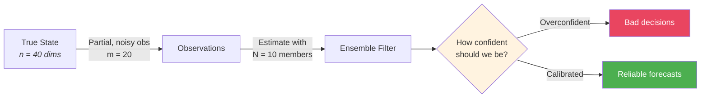

- State estimation under **chaos + partial observations**
- Ensembles must quantify uncertainty, not just estimate states
- Small ensembles collapse: spread **underestimates** true error

<!--
Speaker Notes (90s):
Data assimilation is the problem of estimating the state of a chaotic dynamical system from partial, noisy observations. We represent uncertainty through ensembles—collections of possible states. But in practice, we can only afford small ensembles, far fewer members than state variables. This creates a fundamental tension. With only 10 members describing a 40-dimensional state observed through 20 noisy sensors, ensemble covariances become rank-deficient and sampling noise dominates. The ensemble collapses—its spread dramatically underestimates the true estimation error. An overconfident ensemble is worse than an inaccurate one, because decision-makers rely on uncertainty estimates to assess risk. My dissertation asks: can we design the filter update to maintain calibrated uncertainty even when ensembles are severely undersized?
-->

---

<!-- Slide 3 -->

## Why This Matters

- Computational cost **prohibits** larger ensembles
- Need methods that **extract more from fewer members**
- Calibrated UQ enables rational decisions under uncertainty

<!--
Speaker Notes (75s):
To put this in context: operational weather centers estimate billions of state variables with 20 to 50 ensemble members. That's an undersampling ratio of up to a hundred million to one. Each ensemble member requires running a full atmospheric model—we simply cannot add more. When ensemble spread systematically underestimates error, probabilistic forecasts become unreliable. A system reporting 10% chance of severe weather when the true probability is 40% leads to dangerous decisions. We need methods that extract maximum information from minimal ensembles while honestly quantifying what we don't know. This is the practical motivation for my work.
-->

---

<!-- Slide 4 -->

## Existing Approaches and Their Tradeoffs

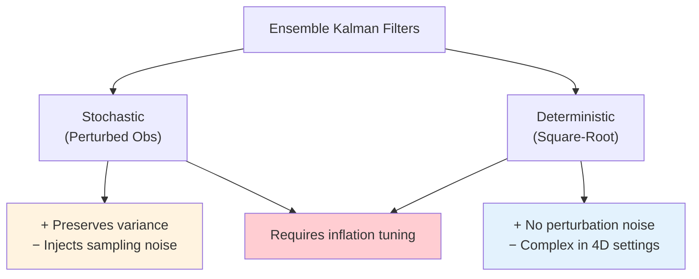

- All existing methods need **ad hoc inflation** to prevent collapse
- Stochastic perturbation noise scales with **obs dimension d**
- No theory connecting regularization to calibration

<!--
Speaker Notes (80s):
The two main paradigms are stochastic and deterministic ensemble filters. Stochastic methods add random perturbations to observations—this preserves ensemble variance in expectation but injects additional sampling noise that scales with observation dimension. Deterministic square-root filters avoid this noise but are more complex to implement, especially in windowed four-dimensional settings. Critically, both families require multiplicative inflation—an ad hoc tuning parameter that artificially enlarges ensemble spread to compensate for variance collapse. No existing framework explains when or why a particular regularization strategy produces calibrated uncertainty. This is the gap.
-->

---

<!-- Slide 5 -->

## The Gap This Dissertation Fills

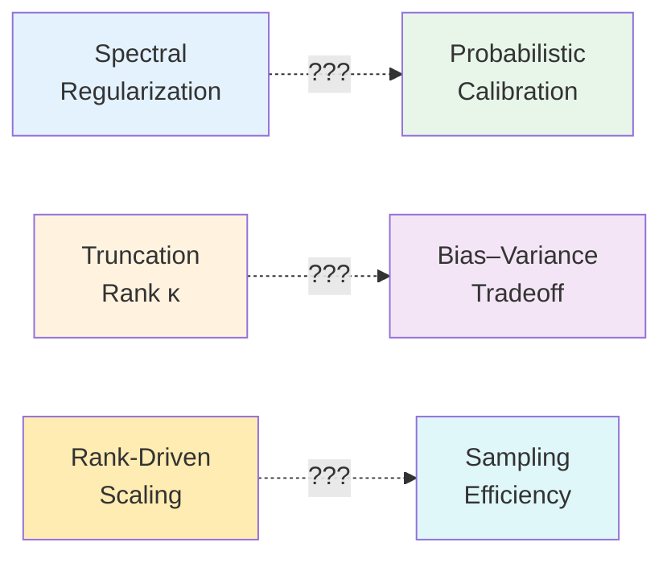

> **Missing**: A unified theory explaining *why* spectral truncation yields calibrated ensembles, *how* truncation rank controls the bias-variance tradeoff, and *when* rank-driven beats dimension-driven sampling.

<!--
Speaker Notes (70s):
Three connections are missing from the literature. First: why does spectral truncation in observation space produce well-calibrated ensembles? The empirical observation exists, but no theoretical explanation. Second: how does the truncation rank kappa control the tradeoff between truncation bias and sampling variance? Third: under what conditions does rank-driven sampling—where variance scales with kappa—outperform dimension-driven sampling—where variance scales with the full observation dimension d? My dissertation provides the theory, the proofs, and the experimental validation for all three connections.
-->

---

<!-- Slide 6 -->

## Research Questions

 

> **RQ1**: Can deterministic spectral regularization achieve calibrated UQ without observation perturbations or inflation?

> **RQ2**: What is the bias-variance decomposition for spectrally truncated ensemble updates?

> **RQ3**: When does rank-driven sampling outperform dimension-driven sampling?

<!--
Speaker Notes (60s):
Three research questions structure the dissertation. First: can we achieve calibrated uncertainty purely through deterministic spectral projection, eliminating both observation perturbations and inflation tuning? Second: what is the precise mathematical decomposition of mean-squared error into truncation bias, sampling variance, and approximation error? Third: in what regimes does the effective rank kappa produce fundamentally better sampling efficiency than the observation dimension d? I answer the first through controlled experiments, the second through rigorous analysis, and the third through both.
-->

---

<!-- Slide 7 -->

## Key Idea: Correct Signal, Preserve Diversity

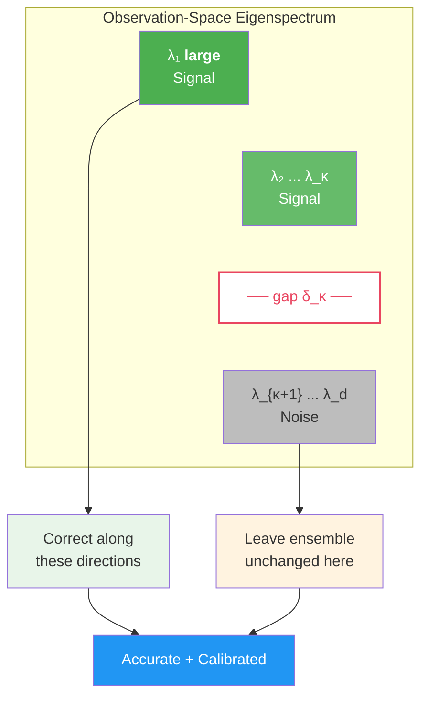

<!--
Speaker Notes (80s):
Here is the core idea. After whitening forecast-observation residuals, their covariance eigenspectrum separates into two regimes. Large eigenvalues correspond to coherent, dynamically meaningful mismatch—this is signal. Small eigenvalues are dominated by sampling noise and measurement error. QPCA-EnDCF exploits this separation: it corrects the ensemble only along the leading kappa eigenmodes, where the data provides genuine information, and leaves all other directions completely unchanged. This preserves ensemble diversity exactly where observations are uninformative. The spectral gap delta-kappa between the kappa-th and kappa-plus-one-th eigenvalue determines how cleanly signal separates from noise, and controls the stability of this decomposition. This selective correction is why the method maintains calibrated uncertainty—it intervenes surgically rather than globally.
-->

---

<!-- Slide 8 -->

## QPCA-EnDCF Pipeline

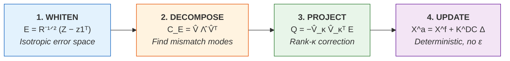

- **No observation perturbations** — zero injected noise
- **No inflation** — spectral truncation is the regularizer
- **Adaptive** — eigenspectrum determines correction subspace

<!--
Speaker Notes (80s):
The algorithm has four stages. First, whiten: multiply forecast-observation residuals by R-inverse-half to make observation errors isotropic. This normalization is essential for meaningful spectral analysis. Second, decompose: compute the eigendecomposition of the centered whitened residual covariance to identify directions of greatest mismatch. Third, project: retain only the leading kappa eigenmodes and construct a rank-kappa correction that targets signal while ignoring noise. Fourth, update: map the observation-space correction to state space via the empirical cross-covariance gain, and apply it deterministically to each ensemble member. No random perturbations at any stage. No inflation parameter to tune. The eigenspectrum itself determines what to correct and what to leave alone.
-->

---

<!-- Slide 9 -->

## Experimental Testbed

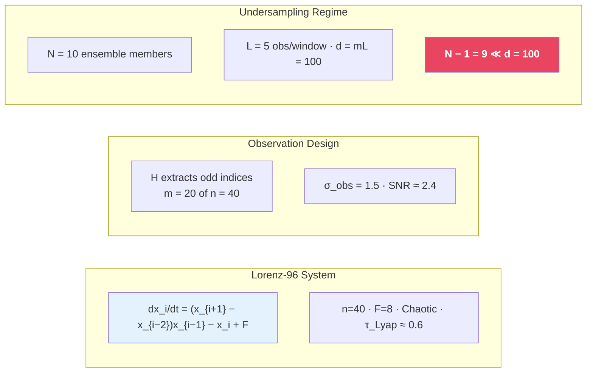

<!--
Speaker Notes (80s):
All experiments use Lorenz-96 with 40 state variables at forcing F equals 8, producing sustained chaos with a Lyapunov timescale of about 0.6 time units. We observe only 20 of 40 states—every other variable—making the inverse problem ill-posed at any single time. The ensemble has only 10 members. For windowed methods, we stack 5 observation times into windows spanning about 0.83 Lyapunov times, creating a stacked observation dimension of d equals 100. This means the sample covariance has rank at most N-minus-1 equals 9 in a 100-dimensional space—extreme undersampling by design. The signal-to-noise ratio of 2.4 is in the intermediate regime where both under- and over-regularization are costly. This configuration is deliberately severe to stress-test calibration.
-->

---

<!-- Slide 10 -->

## Three Algorithms Compared

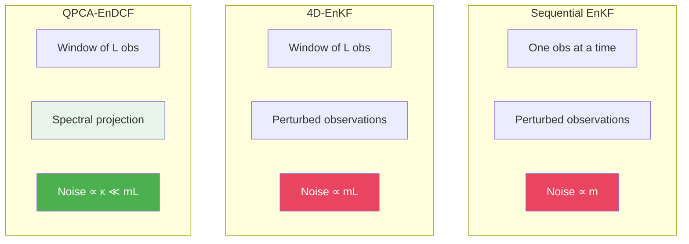

> Perturbation noise grows with **d = mL**. Projector estimation noise grows with **κ**.
> In our setup: **κ = 1** vs **d = 100**.

<!--
Speaker Notes (75s):
We compare three methods. Sequential EnKF processes one observation time at a time with perturbed observations—its noise scales with m. The 4D-EnKF assimilates windows of L observations jointly, gaining temporal information but amplifying perturbation noise to scale with m-times-L. QPCA-EnDCF also uses windows but replaces perturbations with spectral projection—its noise scales with the truncation rank kappa. This is the fundamental difference: stochastic methods pay a noise penalty proportional to observation dimension d, which equals 100 in our setup. QPCA-EnDCF's noise scales with kappa, which equals 1. A hundred-fold difference in the noise-relevant dimension. Both stochastic methods use 5% multiplicative inflation; QPCA-EnDCF uses none.
-->

---

<!-- Slide 11 -->

## Theory: MSE Decomposition

$$\text{MSE} = \underbrace{\|\mathbb{E}[\bar{\mathbf{x}}^a] - \mathbf{x}^{\text{true}}\|^2}_{\text{Bias}^2(\kappa, s)} + \underbrace{\mathbb{E}[\|\bar{\mathbf{x}}^a - \mathbb{E}[\bar{\mathbf{x}}^a]\|^2]}_{\text{Variance}(N, \kappa, s)}$$

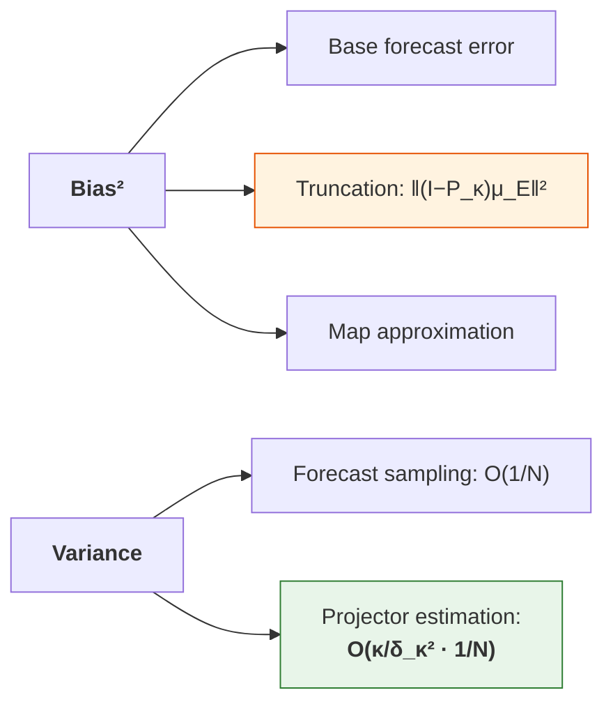

<!--
Speaker Notes (90s):
The main theoretical result is Theorems 4 and 5: a bias-variance decomposition for the analysis mean-squared error. The bias has three sources. The base forecast bias is irreducible—it depends on how well the forecast tracks the truth. The truncation term measures how much of the mean innovation falls outside the retained kappa-dimensional subspace—this is the cost of spectral truncation. The map approximation term accounts for using an approximate QoI map. The variance also has key structure. Standard forecast sampling variance is O(1/N). But the distinctive term is the projector estimation contribution: it's O(1/N) but with a prefactor of kappa over delta-kappa-squared. This prefactor depends on the truncation rank and spectral gap, not on the observation dimension d. This is the theoretical basis for QPCA-EnDCF's efficiency advantage.
-->

---

<!-- Slide 12 -->

## The Central Theoretical Result

| | Stochastic EnKF | QPCA-EnDCF |
|---|---|---|
| **Noise source** | Observation perturbations | Projector estimation |
| **Variance scales with** | **d = mL = 100** | **κ = 1** |
| **Window length effect** | More noise (∝ L) | More signal (spectral gap ↑) |
| **Inflation** | Required | Not needed |

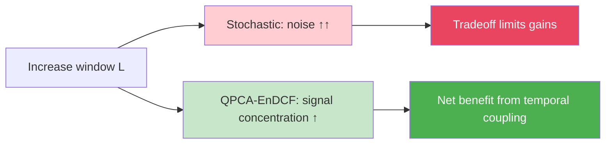

<!--
Speaker Notes (90s):
This is the most important theoretical insight. When stochastic methods increase window length L to exploit temporal correlations, their perturbation noise grows proportionally—the Frobenius norm of the perturbation error scales as d over root-N, where d equals m-times-L. There's a fundamental tradeoff: more temporal information but more noise. QPCA-EnDCF breaks this tradeoff. Its variance scales with kappa, not d. When you increase L, you gain temporal information that concentrates signal into fewer dominant modes and increases the spectral gap—both favorable. The noise penalty from projector estimation stays governed by kappa equals 1. So QPCA-EnDCF can exploit long windows purely for information gain without paying the perturbation tax. This is why windowed operation with L greater than or equal to 3 is essential for the method's advantage.
-->

---

<!-- Slide 13 -->

## Theory: The Proof Chain

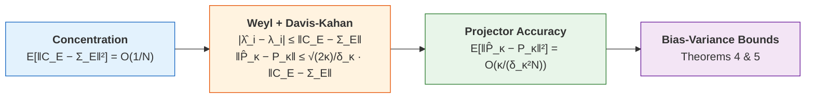

- **Mild assumptions**: finite 4th moments (weaker than Gaussianity)
- **Cutoff gap** $\delta_\kappa = \lambda_\kappa - \lambda_{\kappa+1} > 0$ ensures projector stability
- Gaussian case: exact Wishart identities sharpen bounds

<!--
Speaker Notes (80s):
The proof proceeds in three stages. First, concentration: sample covariance converges to population covariance at rate O(1/N) in Frobenius norm, requiring only finite fourth moments—strictly weaker than Gaussianity. Second, spectral perturbation: Weyl's inequality translates covariance accuracy to eigenvalue accuracy, and the Davis-Kahan theorem translates it to eigenvector and projector accuracy, with a prefactor involving the cutoff gap delta-kappa. Third, these combine to give the bias-variance bounds in the main theorems. The critical structural requirement is the cutoff gap—the kappa-th eigenvalue must be well-separated from the kappa-plus-one-th. In our experiments with kappa equals 1, the leading eigenvalue captures 60 to 80 percent of residual variance, ensuring a large gap.
-->

---

<!-- Slide 14 -->

## Results: The Headline Numbers

 

| | Spread-Skill Ratio $\bar\gamma$ | Spread-RMSE Correlation $\rho$ | RMSE |
|---|:---:|:---:|:---:|
| Seq-EnKF | 0.10 | 0.01 | 4.51 |
| 4D-EnKF | 0.12 | 0.22 | 4.42 |
| **QPCA-EnDCF** | **0.81** | **0.82** | **3.55** |
| *Ideal* | *1.00* | *1.00* | *—* |

 

> QPCA-EnDCF: **8x better calibration**, **20% lower RMSE**, **no inflation**

<!--
Speaker Notes (80s):
Here are the headline results. The spread-skill ratio measures whether ensemble spread matches the actual estimation error—ideal is 1.0. QPCA-EnDCF achieves 0.81, close to ideal. Stochastic methods are below 0.12—their spread is an order of magnitude too small. The spread-RMSE correlation measures temporal tracking—does the ensemble know when it's doing well or poorly? QPCA-EnDCF achieves 0.82; sequential EnKF is effectively zero—its spread is disconnected from reality. And QPCA-EnDCF simultaneously reduces RMSE by 20 percent. This is not a tradeoff: better accuracy and better-calibrated uncertainty, with no inflation parameter. The stochastic methods use 5 percent multiplicative inflation and still collapse catastrophically.
-->

---

<!-- Slide 15 -->

## Results: Temporal Tracking

- **QPCA-EnDCF**: spread and RMSE co-vary throughout
- **Stochastic methods**: spread flat near zero, blind to actual error

<!--
Speaker Notes (75s):
This figure shows spread and RMSE over 50 assimilation windows. For QPCA-EnDCF, the solid spread line and dashed RMSE line move together—when estimation becomes harder, the ensemble honestly reports greater uncertainty. For sequential EnKF, spread is pinned near 0.3 regardless of RMSE fluctuations between 3 and 6—the ensemble has collapsed and lost all connection to reality. The 4D-EnKF shows marginally larger spread but still no meaningful tracking. This temporal co-variation is the signature of calibrated uncertainty and is critical for operational use. Decision-makers need to know not just the average reliability but whether to trust a particular forecast more or less.
-->

---

<!-- Slide 16 -->

## Results: Distributional Calibration

| | Flatness | Interpretation |
|---|:---:|---|
| Seq-EnKF | 1.861 | Severe U-shape: **extreme underdispersion** |
| 4D-EnKF | 1.796 | U-shape: **persistent underdispersion** |
| **QPCA-EnDCF** | **0.199** | Near-flat: **well-calibrated distribution** |

<!--
Speaker Notes (80s):
Rank histograms test full distributional calibration without Gaussian assumptions. If the truth is exchangeable with ensemble members, all ranks occur equally—a flat histogram. The stochastic methods show severe U-shapes: the truth falls outside the ensemble range far too often, the classic signature of underdispersion. QPCA-EnDCF is nearly flat with a flatness metric of 0.199 versus 1.86—an order of magnitude improvement. The chi-squared statistics tell the same story: 397 for QPCA-EnDCF versus 173,000 for sequential EnKF—three orders of magnitude. This confirms that the calibration advantage extends beyond second moments to the full ensemble distribution.
-->

---

<!-- Slide 17 -->

## Results: Bias-Variance Structure

- Stochastic methods: ~50% bias, ~50% variance — **variance-dominated**
- QPCA-EnDCF: **82% bias, 18% variance** — variance nearly eliminated
- Total MSE reduced by **~40%** (12.97 vs 21.86 / 21.22)

<!--
Speaker Notes (80s):
This figure directly validates the theory. The left panel shows absolute MSE decomposition. Stochastic methods have total MSE around 21, split roughly equally between bias-squared and variance. QPCA-EnDCF reduces total MSE to about 13—a 40 percent reduction. The right panel shows the composition: QPCA-EnDCF is 82 percent bias, only 18 percent variance. It has almost eliminated sampling variance, consistent with the theoretical prediction that rank-driven variance scaling with kappa equals 1 is far smaller than dimension-driven scaling with d equals 100. The remaining error is primarily bias—systematic truncation effects—which could be reduced by increasing kappa or the ensemble size.
-->

---

<!-- Slide 18 -->

## Results: Ensemble Size Scaling

- QPCA-EnDCF **near-calibrated at N = 10**; stochastic methods need N ≥ 50
- At N = 10: **2-3x accuracy savings**, **5x calibration savings**
- Convergence to ideal confirms **O(1/N) theory**

<!--
Speaker Notes (80s):
This figure shows calibration versus ensemble size. QPCA-EnDCF reaches a spread-skill ratio of about 0.8 at N equals 10 and approaches 1.0 by N equals 30. Stochastic methods don't reach 0.8 until N equals 50 or more. The crossover analysis quantifies computational savings: QPCA-EnDCF at N equals 10 achieves accuracy comparable to stochastic methods at N equals 20 to 30—two to three times fewer ensemble members. For calibration, the advantage is even larger: QPCA-EnDCF at N equals 10 surpasses stochastic methods at N equals 50—five times fewer members. Each member requires a full model integration, so these savings translate directly to computational cost. The smooth convergence toward ideal calibration as N grows validates the O(1/N) theoretical predictions.
-->

---

<!-- Slide 19 -->

## Why It Works: Geometric Mechanism

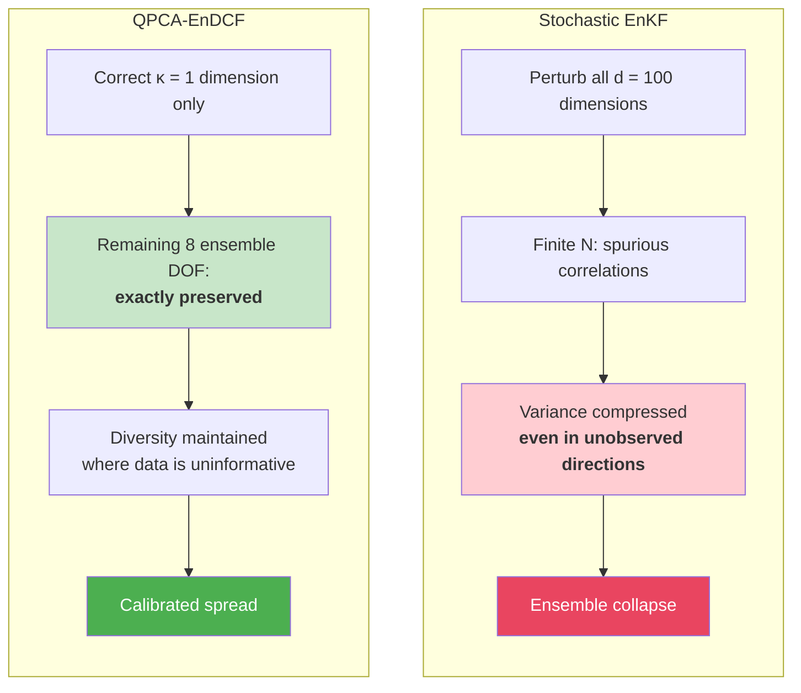

<!--
Speaker Notes (80s):
The geometric picture explains the mechanism precisely. Stochastic methods inject random perturbations across all 100 observation-space dimensions. With only 10 ensemble members, these perturbations create spurious cross-correlations that compress the ensemble not just along correction directions but also in orthogonal directions where the ensemble should remain spread out. The result is systematic variance loss—collapse. QPCA-EnDCF does something fundamentally different: it identifies the single most important correction direction spectrally and applies corrections only there. The remaining 8 degrees of freedom in the 9-dimensional ensemble subspace are left exactly unchanged. There is no mechanism for spurious variance compression in those directions. This selective intervention is why the method preserves calibrated spread without needing inflation.
-->

---

<!-- Slide 20 -->

## Contributions and Limitations

**This dissertation establishes:**

1. Unified theory: spectral regularization $\rightarrow$ calibrated UQ
2. Bias-variance decomposition with explicit $\kappa$, $\delta_\kappa$, $N$ dependence
3. Rank-driven ($\kappa$) vs dimension-driven ($d$) variance scaling
4. Inflation-free filtering through spectral truncation
5. Operational thresholds: $N \geq 10$, $L \geq 3$

**Limitations informing future work:**

- Perfect-model setting (no model error)
- Low-dimensional testbed ($n = 40$ vs operational $10^6$+)
- Fixed linear observation operator
- Adaptive $\kappa$ selection not yet developed

<!--
Speaker Notes (80s):
Five contributions. First, the theoretical framework connecting spectral regularization to calibration. Second, the bias-variance decomposition with explicit dependence on truncation rank, spectral gap, and ensemble size. Third, the identification of rank-driven versus dimension-driven variance scaling as the fundamental mechanism. Fourth, the practical result that spectral regularization eliminates inflation tuning. Fifth, concrete operating thresholds. The limitations are standard for foundational work. No model error—the highest-priority extension. Low dimension—localization interaction at scale is an open question. Linear observations—the theory extends to nonlinear operators since concentration bounds need only moment conditions, not linearity. And adaptive kappa selection remains future work, though sensitivity analysis shows robustness across kappa in 1 to 3.
-->

---

<!-- Slide 21 -->

## Conclusion

 

### Deterministic spectral regularization is a practical route to reliable UQ

 

| Claim | Evidence |
|---|---|
| Near-ideal calibration under severe undersampling | $\bar\gamma = 0.81$, $\rho = 0.82$ at $N = 10$ |
| Theory explains why | Variance ~ $\kappa/\delta_\kappa^2$, not $d$ |
| Simultaneously more accurate | 20% RMSE reduction |
| Eliminates tuning | No inflation, robust to $\kappa \in \{1,2,3\}$ |
| Computational savings | 2-5x fewer ensemble members needed |

 

> *How* we regularize ensemble corrections has first-order effects on uncertainty quantification.

<!--
Speaker Notes (70s):
To summarize: this dissertation demonstrates that deterministic spectral regularization through QPCA-EnDCF provides a principled, practical route to reliable uncertainty quantification in ensemble data assimilation. The theoretical framework explains why: by replacing dimension-dependent variance with rank-dependent variance, spectral truncation achieves fundamentally better sampling efficiency. Experiments confirm simultaneous improvements in accuracy and calibration with no tuning parameters. The core message is simple: how we regularize ensemble corrections is not a minor implementation detail—it has first-order effects on whether ensembles honestly represent uncertainty. Spectral methods offer a superior balance of theory, practice, and computational efficiency. Thank you. I welcome your questions.
-->
